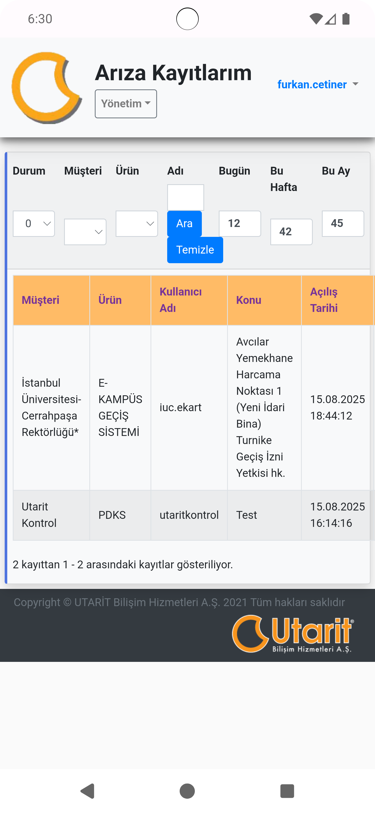
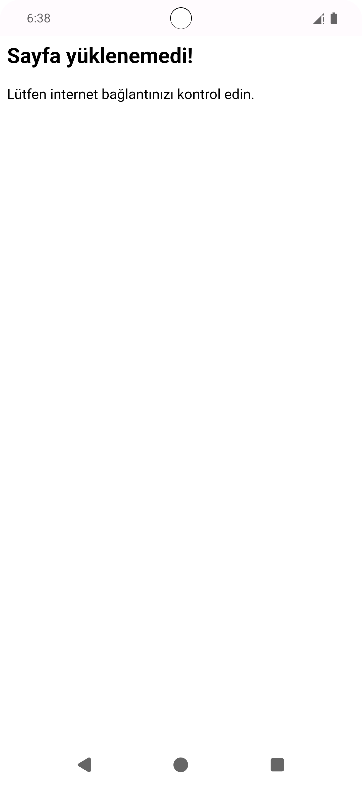

# Service Center App
Uygulama açıldığı zaman webview ile uygulama içerisinden direkt olarak "http://servicecenter.utarit.com.tr/frmLogon.aspx?ReturnUrl=%2f" adresine erişim sağlar.

# Uygulamada Kullanılanlar
- Webview
- View Binding
- Fragment
- Loading ve error kontrolleri
- Responsive olmayan sayfalar için zoom yapma veya uyumlu sayfa açılışı ayarları.

# Uygulamada İçi Görseller

 
  
  
  

